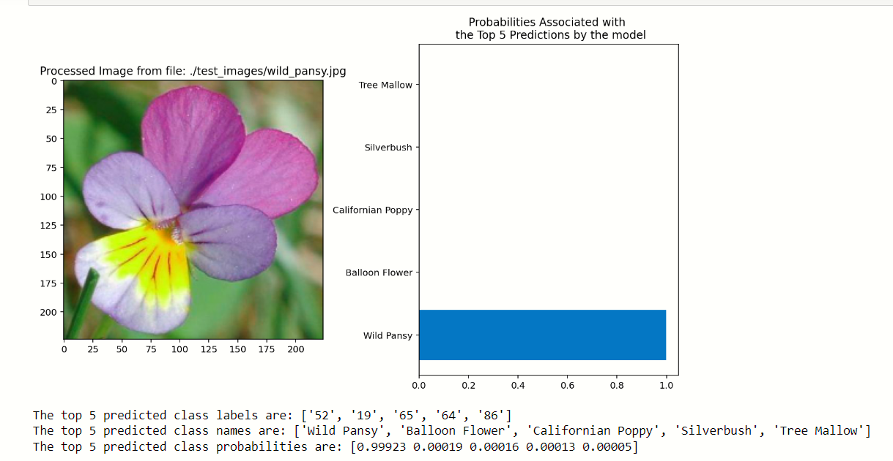

# Intro to Machine Learning - TensorFlow Project

In this project, I first developed code for an image classifier built with TensorFlow (Part 1 - Jupyter notebook), then i converted it into a command line application to predict new images using the trained model (Part 2 - Command Line Application).

***My First Machine Learning Project with Tensorflow***

## Data

I have used `tensorflow_datasets` to load the [Oxford Flowers 102 dataset](https://www.tensorflow.org/datasets/catalog/oxford_flowers102). This dataset has 3 splits: `'train'`, `'test'`, and `'validation'`.  The training data was normalized and resized to 224x224 pixels as required by the pre-trained networks.

The validation and testing sets are used to measure the model's performance on data it hasn't seen yet (the data was normalized and resized the images to the appropriate size).

## Part 1 - Image Classifier Development
In this part, i worked through a Jupyter notebook to implement an image classifier with TensorFlow. The output of this part is a saved classifier `my_model_1.h5`

## Part 2 - Building the Command Line Application
Now that i built and trained a deep neural network on the flower data set, it's time to convert it into an application that others can use. The application is a Python script that run from the command line. For testing, i used the saved Keras model saved in the first part to predict images from the folder `./test_images`.

### Specifications

This part includes a `predict.py` file that uses the previously trained network in part-1 to predict the class for an input image. There is a `helper_functions.py` file that holds the needed functions to preprocess the images and make the predictions using the pretrained classifier. 

#### Basic usage:

`$ python predict.py /path/to/image saved_model`

#### Options:
* `--top_k` : Return the top $K$ most likely classes (default is 5):

`$ python predict.py /path/to/image saved_model --top_k K`

* `--category_names` : This is a boolean switch that displays the class name of the predicted flower that is pertinent to the label. 

`$ python predict.py /path/to/image saved_model --category_names `

## Examples

For the following examples, we assume we have a file called **`orchid.jpg`** in a folder named **`/test_images/`** that contains the image of a flower. We also assume that we have a Keras model saved in a file named **`my_model.h5`**.

### Basic usage:

`$ python predict.py ./test_images/orchid.jpg my_model.h5`

### Options:

* Return the top 3 most likely classes:

`$ python predict.py ./test_images/orchid.jpg my_model.h5 --top_k 3`

* Adding the option `--category_names` will list the class names that are included in the `label_map.json` file to map labels to flower names:

`$ python predict.py ./test_images/orchid.jpg my_model.h5 --category_names`
